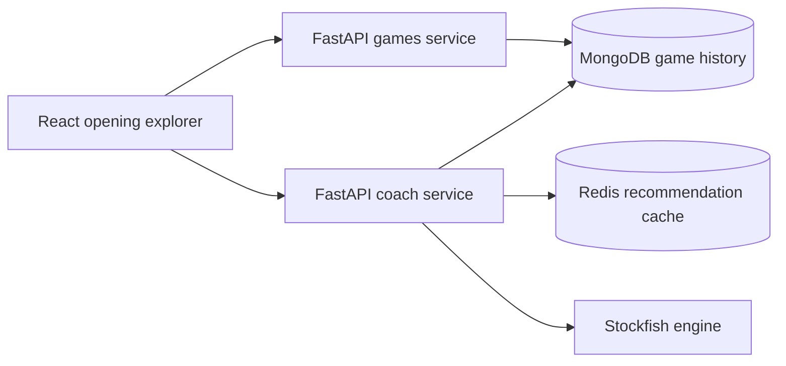

# Chess Coach

Chess Coach turns a Lichess player's rapid-game history into an interactive
opening map, then combines Stockfish evaluation with peer statistics and
repertoire fit to recommend practical next moves.

This project is designed as a production-shaped full-stack system rather than a
single analysis script: it separates game access from recommendation work,
caches expensive calculations, offers focused production and diagnostic
development views, and ships with automated tests and deployment gates.

## Product highlights

- Search for an imported Lichess player, with `ericrosen` as the default demo
- Explore the player's most frequent opening branches on an interactive board
- Play a recommendation or drag a legal move to continue an analysis line
- Compare practical candidates using engine evaluation and peer-game evidence
- Precompute and cache expensive recommendation branches in Redis
- Keep raw FEN and cache warmup controls in development mode only
- Recover cleanly from malformed usernames, unknown players, and API failures

## Architecture



| Layer | Technology |
| --- | --- |
| Frontend | React 19, Vite, chess.js, react-chessboard |
| Games API | FastAPI, Motor, MongoDB |
| Coach API | FastAPI, python-chess, Stockfish, PyMongo async |
| Cache | Redis |
| Data collection | Python, Berserk, Lichess API |
| Delivery | Docker Compose, Nginx, Caddy, GitHub Actions |
| Testing | Vitest, Pytest |

## Repository layout

```text
.
├── chess-ui/             React application and frontend tests
├── game-scraper/         Games API and MongoDB access
├── coach-ai/             Recommendation API, ranking, Stockfish, and Redis
├── backend/              Lichess collection and ingestion utilities
├── data/                 Local generated data (ignored by Git)
├── docker-compose.dev.yml
├── docker-compose.yml    Production stack
└── DEPLOYMENT.md         Production release setup and runbook
```

## Run locally

### Prerequisites

- Docker and Docker Compose
- A MongoDB connection containing imported Lichess games
- Node.js 20+ and Python 3.11+ only if running services outside Docker

Copy the safe examples, then replace the MongoDB values with your development
connection:

```bash
cp chess-ui/.env.example chess-ui/.env
cp game-scraper/.env.example game-scraper/.env
cp coach-ai/.env.example coach-ai/.env
```

Start the development stack:

```bash
docker compose -f docker-compose.dev.yml up --build
```

Open:

- UI: <http://localhost:5173>
- Games API docs: <http://localhost:8000/docs>
- Coach API docs: <http://localhost:8001/docs>
- Coach health check: <http://localhost:8001/health>

The app queries already-imported games. An unknown username therefore returns a
clear “no imported rapid games” response instead of silently building an empty
tree.

## Development and production views

`VITE_APP_MODE=development` displays cache warmup controls, progress, raw FEN,
and a mode badge. Production builds set `VITE_APP_MODE=production`, leaving the
player search, board, current line, recommendations, and continuations visible.

To inspect diagnostics in a production-mode local build, set
`VITE_SHOW_DEVELOPER_TOOLS=true` explicitly.

## Tests and quality checks

Frontend:

```bash
cd chess-ui
npm ci
npm run test
npm run lint
npm run build
```

Python services:

```bash
cd game-scraper && pip install -r requirements-dev.txt && pytest -q
cd ../coach-ai && pip install -r requirements-dev.txt && pytest -q
```

CI runs these suites for both `main` and `prod`, then validates and builds the
production containers.

## API overview

### Player games

```http
GET /games/user/{username}
```

The route validates Lichess-compatible usernames, performs a case-insensitive
lookup, and returns `404` when no imported games are available.

### Position recommendation

```http
POST /recommend/position
```

```json
{
  "fen": "r1bqkbnr/pppppppp/2n5/8/8/2N5/PPPPPPPP/R1BQKBNR w KQkq - 2 2",
  "user_id": "ericrosen",
  "rating": 2538,
  "color": "white",
  "max_candidates": 6,
  "use_cache": true,
  "refresh_cache": false,
  "force_recompute": false
}
```

Cache keys include normalized FEN, player, rating, candidate count, engine
depth, and recommender version so expensive work can be reused safely.

## Security and deployment

- Real `.env` files, keys, certificates, local databases, generated data, and
  build/test output are ignored.
- Each Docker context excludes real environment files so credentials cannot be
  copied into images by `COPY . .`.
- GitHub Actions deploys only the `prod` branch after CI succeeds.
- Production credentials live in a protected GitHub environment, never in the
  repository.

See [DEPLOYMENT.md](DEPLOYMENT.md) for required secrets and the release flow.

## License

MIT — see [LICENSE](LICENSE).
