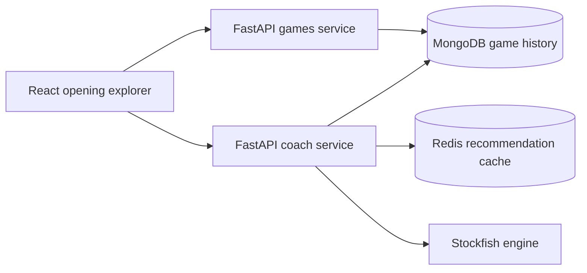

# Choco Chess Coach (CCC)

Choco Chess Coach (CCC) turns a Lichess player's rapid-game history into an
interactive opening map, then combines Stockfish evaluation with peer
statistics and repertoire fit to recommend practical next moves.

This project is designed as a production-shaped full-stack system rather than a
single analysis script: it separates game access from recommendation work,
caches expensive calculations, offers focused production and diagnostic
development views, and ships with automated tests and deployment gates.

## Product highlights

- Search for an imported Lichess player, with `ericrosen` as the default demo
- Explore the player's most frequent opening branches on an interactive board
- Play a recommendation or drag a legal move to continue an analysis line
- Compare practical candidates using engine evaluation and peer-game evidence
- Approve moves into named, nested opening repertoires for selected players
- Compare a player's historical games with the saved repertoire and surface the
  first divergence in each game
- Pause computed recommendations and explore persisted repertoire moves without
  spending additional engine time
- Precompute and cache expensive recommendation branches in Redis
- Keep the Current Line panel, raw FEN, and cache warmup controls in development mode only
- Present project details, dated development history, and a privacy-preserving
  contact form on dedicated pages
- Switch between 🇺🇸 English, 🇴🇲 Omani Arabic with a full RTL layout, and
  🇯🇵 Japanese, using bundled multilingual web fonts
- Recover cleanly from malformed usernames, unknown players, and API failures

## Architecture



| Layer | Technology |
| --- | --- |
| Frontend | React 19, Vite, chess.js, react-chessboard |
| Games API | FastAPI, Motor, MongoDB |
| Coach API | FastAPI, python-chess, Stockfish, PyMongo async |
| Cache | Redis |
| Data collection | Python, Berserk, Lichess API |
| Delivery | Docker Compose, Nginx, Caddy, GitHub Actions |
| Testing | Vitest, Pytest |

## Repository layout

```text
.
├── chess-ui/             React application and frontend tests
├── game-scraper/         Games API and MongoDB access
├── coach-ai/             Recommendation API, ranking, Stockfish, and Redis
├── backend/              Lichess collection and ingestion utilities
├── data/                 Local generated data (ignored by Git)
├── docker-compose.dev.yml
├── docker-compose.yml    Production stack
└── DEPLOYMENT.md         Production release setup and runbook
```

## Run locally

### Prerequisites

- Docker and Docker Compose
- A MongoDB connection containing imported Lichess games
- Node.js 20+ and Python 3.11+ only if running services outside Docker

Copy the safe examples, then replace the MongoDB values with your development
connection:

```bash
cp chess-ui/.env.example chess-ui/.env
cp game-scraper/.env.example game-scraper/.env
cp coach-ai/.env.example coach-ai/.env
```

Start the development stack:

```bash
docker compose -f docker-compose.dev.yml up --build
```

Open:

- UI: <http://localhost:5173>
- Games API docs: <http://localhost:8000/docs>
- Coach API docs: <http://localhost:8001/docs>
- Coach health check: <http://localhost:8001/health>

The app queries already-imported games. An unknown username therefore returns a
clear “no imported rapid games” response instead of silently building an empty
tree.

The public pages are available at `/about`, `/history`, and `/contact`. The
development timeline is maintained as a small dated data array in
`chess-ui/src/content/developmentHistory.js` so new milestones can be added
without changing the page component.

## Languages and fonts

The language selector stores the choice in the browser and updates the page's
language and text direction. English uses Noto Sans and Noto Serif, Arabic uses
Noto Sans Arabic, and Japanese uses Noto Sans JP. These open-licensed WOFF2
fonts are npm dependencies and are emitted as versioned frontend assets during
the Vite build.

Do not install Iowan Old Style or Hiragino on a VPS or application container.
Server-side font installation does not make a font available to a visitor's
browser, and those Apple fonts should not be redistributed without an
appropriate license. `npm ci` installs the bundled fonts during both local and
production image builds; after dependency changes, rebuild the UI image with:

```bash
docker compose -f docker-compose.dev.yml up -d --build chess-ui
```

## Contact delivery

The browser never receives the destination email address. Contact submissions
go through the Games API, which adds a signed time challenge, a hidden honeypot,
strict field limits, header-injection checks, and a per-IP hourly rate limit
before handing the message to an SMTP relay.

Configure these server-only values in `game-scraper/.env`:

```dotenv
CONTACT_RECIPIENT=private-recipient@example.com
CONTACT_SENDER=ccc-contact@example.com
CONTACT_FORM_SECRET=replace-with-at-least-24-random-characters
SMTP_HOST=smtp.example.com
SMTP_PORT=587
SMTP_USERNAME=ccc-contact@example.com
SMTP_PASSWORD=replace-with-an-app-password
SMTP_SECURITY=starttls
```

Use `SMTP_SECURITY=ssl` for an implicit-TLS relay on port 465. Never prefix
these variables with `VITE_`; Vite variables are shipped to the browser.

## Repertoire workflow

Repertoire access is intentionally limited to `ericrosen` and `chocoroku` by
default. A selected player can have multiple named opening lines, and a line may
use another line as its parent—for example, a Traxler line nested beneath an
Italian Game line. Saved repertoire choices use green board arrows, while live
computed recommendations use gold arrows.

To manage the repertoire:

1. Open a selected player and create or select a named line.
2. Enter the server's private management key in the Repertoire panel. It is
   retained only for the current browser tab.
3. Approve a computed candidate at the current position and continue building
   the saved line position by position.
4. Use the recommendation switch to pause or resume engine computation.

Configure the allowlist and management key in `coach-ai/.env`:

```dotenv
REPERTOIRE_USERS=ericrosen,chocoroku
REPERTOIRE_WRITE_KEY=replace-with-a-long-private-management-key
```

Keep `VITE_REPERTOIRE_USERS` in `chess-ui/.env` aligned with the server allowlist.
The UI allowlist controls visibility only; the Coach API independently enforces
both the selected user and the private write key.

## Development and production views

`VITE_APP_MODE=development` displays the Current Line panel, cache warmup
controls, progress, raw FEN, and a mode badge. Production builds set
`VITE_APP_MODE=production`, leaving the player search, board, recommendations,
and continuations visible.

To inspect diagnostics in a production-mode local build, set
`VITE_SHOW_DEVELOPER_TOOLS=true` explicitly. This override does not display the
Current Line panel outside development mode.

## Interaction and cache tuning

Piece movement uses a short 120 ms transition, and the board is memoized so
cache progress cannot repeatedly redraw it. Startup warming is non-blocking and
targets the selected player's most frequently visited opening positions.
Follow-up warming begins after a short idle delay so it does not compete with a
move being displayed.

Recommendation caching has three safeguards tailored to the two selected
accounts:

- The browser keeps a bounded 256-position LRU and joins duplicate requests
  already in flight.
- Redis shares Stockfish and peer analysis across accounts in the same rating
  bucket, then stores a separate final result for each account.
- Cache keys normalize away FEN move clocks, and results remain hot for 30 days
  by default. Redis is capped at 256 MB with LRU eviction.

The main tuning values are `VITE_BOARD_ANIMATION_MS`,
`VITE_WARMUP_MAX_POSITIONS`, `VITE_WARMUP_DEPTH`,
`VITE_BACKGROUND_WARMUP_BRANCHING`, `CACHE_TTL_SECONDS`, and
`REDIS_MAX_MEMORY`.

## Developer

Choco Chess Coach is developed by **Ahmed H. K. Al Ghafri**, also known as
**ChocoRoku**.

## Tests and quality checks

Frontend:

```bash
cd chess-ui
npm ci
npm run test
npm run lint
npm run build
```

Python services:

```bash
cd game-scraper && pip install -r requirements-dev.txt && pytest -q
cd ../coach-ai && pip install -r requirements-dev.txt && pytest -q
```

CI runs these suites for both `main` and `prod`, then validates and builds the
production containers.

## API overview

### Player games

```http
GET /games/user/{username}
```

The route validates Lichess-compatible usernames, performs a case-insensitive
lookup, and returns `404` when no imported games are available.

### Position recommendation

```http
POST /recommend/position
```

```json
{
  "fen": "r1bqkbnr/pppppppp/2n5/8/8/2N5/PPPPPPPP/R1BQKBNR w KQkq - 2 2",
  "user_id": "ericrosen",
  "rating": 2538,
  "color": "white",
  "max_candidates": 6,
  "use_cache": true,
  "refresh_cache": false,
  "force_recompute": false
}
```

Cache keys include normalized FEN, player, rating, candidate count, engine
depth, and recommender version so expensive work can be reused safely.

### Contact form

```http
GET /contact/challenge
POST /contact
```

### Repertoire

```http
GET    /repertoire/{user_id}
POST   /repertoire/lines
POST   /repertoire/lines/{line_id}/moves
DELETE /repertoire/lines/{line_id}/moves/{move_id}
DELETE /repertoire/lines/{line_id}
```

All repertoire mutations require the `X-Repertoire-Key` request header.

## Security and deployment

- Real `.env` files, keys, certificates, local databases, generated data, and
  build/test output are ignored.
- Each Docker context excludes real environment files so credentials cannot be
  copied into images by `COPY . .`.
- GitHub Actions deploys only the `prod` branch after CI succeeds.
- Production credentials live in a protected GitHub environment, never in the
  repository.

See [DEPLOYMENT.md](DEPLOYMENT.md) for required secrets and the release flow.

## License

MIT — see [LICENSE](LICENSE).
